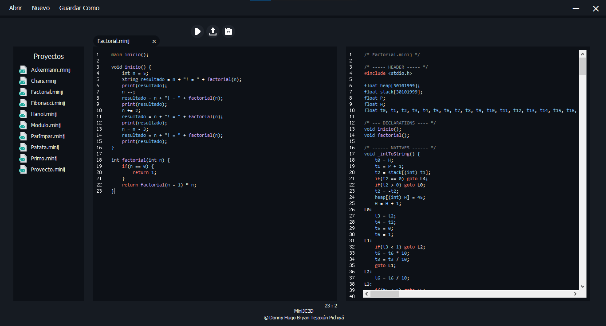

# MiniJCompiler
## Generador de Código de 3 Direcciones: JFlex y CUP
Versión minimizada de c++.  
Implementa patrón de diseño interpreter.  
Genera código de 3 direcciones con sintaxis de c++.  
Simula heap y stack con vectores.

## VSCode Theme


## GitHub Theme


## Eclipse Theme


## Gramática Libre del Contexto
```html
<INIT> ::= <INSTSGLOBAL>

<INSTSGLOBAL> ::=
    <INSTSGLOBAL> <INSTGLOBAL> |
    <INSTGLOBAL>

<INSTGLOBAL> ::=
    <CALLMAINFUNC> |
    <DECLID>       |
    <DECLFUNC>

<CALLMAINFUNC> ::=
    'main' <CALLFUNC> ';'

<CALLFUNC> ::=
    TK_id '(' <LISTARGS> ')' |
    TK_id '(' ')'

<LISTARGS> ::=
    <LISTARGS> ',' <EXP> |
    <EXP>

<DECLID> ::=
    <TYPE> <INITIDS> ';'

<INITIDS> ::=
    <INITIDS> ',' <INITID> |
    <INITID>

<INITID> ::=
    TK_id '=' <EXP> |
    TK_id

<DECLFUNC> ::=
    <TYPE> TK_id '(' <LISTPARAMS> ')' <ENV> |
    'void' TK_id '(' <LISTPARAMS> ')' <ENV> |
    <TYPE> TK_id '(' ')' <ENV>              |
    'void' TK_id '(' ')' <ENV>

<LISTPARAMS> ::=
    <LISTPARAMS> ',' <TYPE> TK_id |
    <TYPE> TK_id

<IFSTRUCT> ::=
    'if' '(' <EXP> ')' <ENV> 'else' <IFSTRUCT> |
    'if' '(' <EXP> ')' <ENV> 'else' <ENV>      |
    'if' '(' <EXP> ')' <ENV>

<SWITCHSTRUCT> ::=
    'switch' '(' <EXP> ')' <ENVS>

<ENVS> ::=
    '{' <CASESDEFAULT> '}' |
    '{' '}'

<CASESDEFAULT> ::=
    <CASES> <DEFAULT> |
    <CASES>           |
    <DEFAULT>

<CASES> ::= 
    <CASES> <CASE> |
    <CASE>

<CASE> ::= 
    'case' <EXP> ':' <INSTRUCTIONS> |
    'case' <EXP> ':' <ENV>          |
    'case' <EXP> ':'

<DEFAULT> ::=
    'default' ':' <INSTRUCTIONS> |
    'default' ':' <ENV>          |
    'default' ':'

<LOOPFOR> ::=
    'for' '(' <ARGSFOR> ')' <ENV>

<ARGSFOR> ::=
    <INITIALIZEFOR> ';' <EXP> ';' <UPDATESFOR> |
    <INITIALIZEFOR> ';' <EXP> ';'              |
    <INITIALIZEFOR> ';' ';' <UPDATESFOR>       |
    ';' <EXP> ';' <UPDATESFOR>                 |
    <INITIALIZEFOR> ';' ';'                    |
    ';' <EXP> ';'                              |
    ';' ';' <UPDATESFOR>                       |
    ';' ';'

<INITIALIZEFOR> ::=
    <TYPE> <INITIDSFOR> |
    <REASIGNS>

<INITIDSFOR> ::=
    <INITIDSFOR> ',' <INITIDFOR> |
    <INITIDFOR>

<INITIDFOR> ::=
    TK_id '=' <EXP>

<REASIGNS> ::=
    <REASIGNS> ',' <REASIGN> |
    <REASIGN>

<UPDATESFOR> ::=
    <UPDATESFOR> ',' <UPDATEFOR> |
    <UPDATEFOR>

<UPDATEFOR> ::=
    <INCDEC>  |
    <REASIGN> |
    <ADDSUB>

<LOOPWHILE> ::=
    'while' '(' <EXP> ')' <ENV>

<LOOPDOWHILE> ::=
    'do' <ENV> 'while' '(' <EXP> ')' ';'

<REASIGN> ::=
    TK_id '=' <EXP>

<INCDEC> ::=
    TK_id '++' |
    TK_id '--'

<ADDSUB> ::=
    TK_id '+=' <EXP> |
    TK_id '-=' <EXP>

<TERNARY> ::=
    <EXP> '?' <EXP> ':' <EXP>

<PRINT> ::=
    'print' '(' <EXP> ')' ';' |
    'print' '(' ')' ';'

<ENV> ::=
    '{' <INSTRUCTIONS> '}' |
    '{' '}'

<INSTRUCTIONS> ::=
    <INSTRUCTIONS> <INSTRUCTION> |
    <INSTRUCTION>

<INSTRUCTION> ::=
    <DECLID>           |
    <IFSTRUCT>         |
    <SWITCHSTRUCT>     |
    <LOOPFOR>          |
    <LOOPWHILE>        |
    <LOOPDOWHILE>      |
    <REASIGN>      ';' |
    <ADDSUB>       ';' |
    <INCDEC>       ';' |
    <CALLFUNC>     ';' |
    <PRINT>            |
    'return' <EXP> ';' |
    'return'       ';' |
    'continue'     ';' |
    'break'        ';' 

<TYPE> ::=
    'String'  |
    'int'     |
    'boolean' |
    'char'    |
    'double'  

<EXP> ::=
    <ARITHMETICS> |
    <RELATIONALS> |
    <RELATIONALS> |
    <INCDEC>      |
    <CALLFUNC>    |
    <TERNARY>     |
    TK_id         |
    TK_string     |
    TK_char       |
    TK_int        |
    TK_double     |
    'true'        |
    'false'       |
    '(' <EXP> ')'

<ARITHMETICS> ::=
    <EXP> '+' <EXP> |
    <EXP> '-' <EXP> |
    <EXP> '*' <EXP> |
    <EXP> '/' <EXP> |
    <EXP> '^' <EXP> |
    <EXP> '%' <EXP> |
    '-'   <EXP>

<RELATIONALS> ::=
    <EXP> '==' <EXP> |
    <EXP> '!=' <EXP> |
    <EXP> '<=' <EXP> |
    <EXP> '>=' <EXP> |
    <EXP> '<'  <EXP> |
    <EXP> '>'  <EXP>

<RELATIONALS> ::=
    <EXP> '&&' <EXP> |
    <EXP> '||' <EXP> |
    '!'   <EXP> 
```

## Precedencia de Operadores
| Nivel | Asociatividad  |                              Token                               |
|   -   |       -        |                                -                                 |
|   10  | Izquierda      | ```TK_question```, ```TK_colon```                                |
|   9   | Izquierda      | ```TK_or```                                                      |
|   8   | Izquierda      | ```TK_and```                                                     |
|   7   | Derecha        | ```TK_not```                                                     |
|   6   | Izquierda      | ```TK_equequ```, ```TK_notequ```                                 |
|   5   | Izquierda      | ```TK_lessequ```, ```TK_moreequ```, ```TK_less```, ```TK_more``` |
|   4   | Izquierda      | ```TK_plus```, ```TK_minus```                                    |
|   3   | Izquierda      | ```TK_mult```, ```TK_div```, ```RW_mod```                        |
|   2   | No Asociativa  | ```RW_pow```                                                     |
|   1   | Derecha        | ```TK_uminus```                                                  |
|   0   | Izquierda      | ```TK_inc```, ```TK_dec```                                       |

## Instalación JFlex y CUP
* Descargar la JFlex: [JFlex](https://jflex.de/download.html)
* Descargar la CUP: [CUP](http://www2.cs.tum.edu/projects/cup/)
* Incluir las librerías en el proyecto java.

## Generación de Scanner
```java
import java.io.File;
public class GScanner {
    public static void main(String[] args) {
        jflex.Main.generate(
            new File(
                "src/Language/Scanner.jflex"
            )
        );
    }
}
```

## Generación de Parser
```java
public class GParser {
    public static void main(String[] args) {
        generate();
    }
    public static void generate() {
        try {
            java_cup.Main.main(
                new String[] {
                    "-destdir",
                    "src/Language",
                    "-symbols",
                    "TOK",
                    "-parser",
                    "Parser",
                    "src/Language/Parser.cup"
                }
            );
        }
        catch(Exception e) {
            System.out.println(e);
        }
    }
}
```

## Intérprete con JFlex y CUP
Usuario: [brandonT2002](https://github.com/brandonT2002)  
Repositorio: [MiniJ](https://github.com/brandonT2002/MiniJ)

## Intérprete con JavaCC
Usuario: [bryan967132](https://github.com/bryan967132)  
Repositorio: [MiniJInterpreter](https://github.com/bryan967132/MiniJInterpreter)

## Intérprete de Pseudocódigo con JFlex y CUP
Usuario: [bryan967132](https://github.com/bryan967132)  
Repositorio: [PseudoParser](https://github.com/bryan967132/PseudoParser)